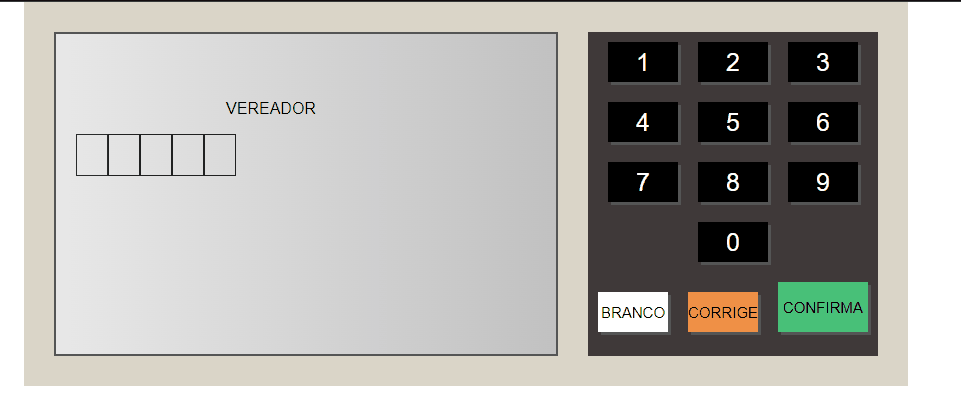

<!DOCTYPE html>
<html>
<head>
    <meta charset="utf-8" />
    <title>Exercício JavaScript</title>
    <meta name="viewport" content="width=device-width, initial-scale=1.0">
</head>

<h1 align="center">Projeto Projeto Urna Eletrônica </h1>

<h2 align="center">Prática Simples</h2>

<h4 align="center">🚧Em construção...🚧</h4>

<h3>Sumário</h3>
<a href="#sobre">Sobre</a>
<a href="#tecnologias">Tecnologias</a>
<a href="#funcionalidades">Funcionalidades</a>
<a href="#gif">GIF</a>

<h3 align="center" id="sobre">Sobre</h3>

Esse projeto trata-se de um exercício da do curso de JavaScript da plataforma B7Web,
com intuito de fortalecer os conceitos e práticas aprendidas durante o curso. O mesmo mesclas 
front-end com práticas de lógica de programação.

<h3 align="center" id="tecnologias">Tecnologias</h3>

Como se trata de um projeto simples, foi usado a tríade do desenvolvimento web básica HTML,CSS e JS. Não é preciso se aprofundar nas funconalidades de cada tecnologia. mas importante salientar HTML para estruturade marcação, CSS para estilos e customização e JS para aplicação de lógicas de programação.

<h3 align="center" id="funcionalidades">Funcionalidades</h3>

[x]Interface Intuitiva
 
 
[x] Simulação de voto
 
 
[ ] Efeitos sonoros
 
 
[ ] Reiniciar votação
 
 
[ ] Contagem de votos
 

<h3 align="center" id="gif">GIF de usablidade</h3>

</img>

<h3 align="center">Muito Obrigado pela atenção🤝🏼</h3>